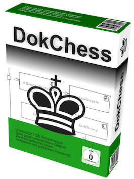

title=1. Einführung und Ziele
type=page
status=published
~~~~~~

Dieser Abschnitt führt in die Aufgabenstellung ein und skizziert die Ziele, die DokChess verfolgt.

## 1.1 Aufgabenstellung

Was ist DokChess?

- DokChess ist eine voll funktionsfähige Schach-Engine.
- Sie dient als einfach zugängliches und zugleich attraktives Fallbeispiel für Architekturentwurf, -bewertung und -dokumentation.
- Der verständliche Aufbau lädt zum Experimentieren und zum Erweitern der Engine ein.
- Ziel ist nicht die höchstmögliche Spielstärke – dennoch gelingen Partien, die Gelegenheitsspielern Freude bereiten.

Wesentliche Features:

- Vollständige Implementierung der FIDE-Schachregeln
- Unterstützt das Spiel gegen menschliche Gegner und andere Schachprogramme
- Beherrscht zentrale taktische Ideen, beispielsweise Gabel und Spieß
- Integration mit modernen grafischen Schach-Frontends

## 1.2 Qualitätsziele

Die folgende Tabelle beschreibt die zentralen Qualitätsziele von DokChess, wobei die Reihenfolge eine grobe Orientierung bezüglich der Wichtigkeit vorgibt.

| Qualitätsziel                                   | Motivation und Erläuterung |
|-------------------------------------------------|----------------------------|
| Zugängliches Beispiel (Analysierbarkeit)        | Da DokChess in erster Linie als Anschauungsmaterial für Architekten und Entwickler dient, erschließen sich Entwurf und Implementierung rasch.|
| Einladende Experimentierplattform (Änderbarkeit)| Alternative Algorithmen und Strategien, etwa zur Bewertung einer Schachstellung, können leicht implementiert und in die Lösung integriert werden. |
| Bestehende Frontends nutzen (Interoperabilität) | DokChess lässt sich mit angemessenem Aufwand in bestehende grafische Schach-Frontends einbinden.|
| Akzeptable Spielstärke (Attraktivität)          |DokChess spielt stark genug, um schwache Gegner sicher zu schlagen und Gelegenheitsspieler zumindest zu fordern.|
| Schnelles Antworten auf Züge (Effizienz)        |Da DokChess in Seminaren und Vorträgen live demonstriert wird, erfolgt die Berechnung der Spielzüge rasch.|

Die Qualitätsszenarien in Abschnitt 10 konkretisieren diese Qualitätsziele und dienen insbesondere auch dazu ihre Erreichung zu bewerten.

## 1.3 Stakeholder