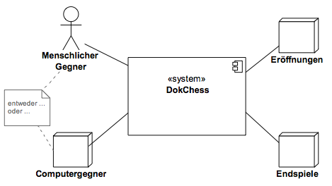

title=3. Kontextabgrenzung
type=page
status=published
~~~~~~

Dieser Abschnitt beschreibt das Umfeld von DokChess. Für welche Benutzer ist es da, und mit welchen Fremdsystemen interagiert es?

## 3.1 Fachlicher Kontext

#### Menschlicher Gegner (Benutzer)
Schach wird zwischen zwei Gegnern gespielt, die abwechselnd ihre Figuren ziehen. DokChess übernimmt die Rolle eines der Gegner, und tritt gegen einen menschlichen Gegner an. Dazu müssen sich die beiden austauschen, beispielsweise über ihre Züge, oder über Remisangebote.

#### Computergegner (Fremdsystem)
Alternativ zu einem menschlichen Gegner kann DokChess auch gegen eine andere Engine antreten. Die Anforderungen bezüglich des Informationsaustausches sind die selben.

#### Eröffnungen (Fremdsystem)
Zur Eröffnung, d.h. zur frühen Phase des Spiels, existiert umfangreiches Wissen in der Schachliteratur. Dieses Wissen ist in Form von Bibliotheken und Datenbanken teils frei und teils auch kommerziell verfügbar. 

Im Rahmen von DokChess wird keine solche Bibliothek erstellt. Stattdessen wird (optional) eine angebunden, um in der Frühphase ein auf Wissen basiertes Spiel zur ermöglichen, wie es menschliche Spieler erwarten.

#### Endspiele (Fremdsystem)
Wenn nur noch sehr wenige Figuren auf dem Brett stehen (z.B. nur die beiden Könige und eine Dame), kann analog zu Eröffnungsbibliotheken auf Endspielbibliotheken zurückgegriffen werden. Diese beinhalten für jede mögliche Stellung mit dieser Figurenkonstellation die Aussage, ob das Spiel gewonnen, unentschieden oder verloren ist, sowie ggf. den nötigen nächsten Schritt zum Sieg. 

Im Rahmen von DokChess wird keine solche Bibliothek erstellt. Stattdessen kann (optional) eine angebunden werden, um klar gewonnene Spiele auch sicher nach Hause zu bringen, oder das Wissen aus den Bibliotheken für Analysen und Stellungsbewertungen zu nutzen.

## 3.2 Technischer- oder Verteilungskontext

#### XBoard Client (Fremdsystem)
Die "Anbindung" menschlicher Spieler erfolgt über ein grafisches Frontend, dessen Entwicklung nicht Teil von DokChess ist. Stattdessen kann jedes grafische Frontend verwendet werden, welches das sogenannte XBoard-Protokoll unterstützt. Hierzu zählen Xboard (bzw. Winboard unter Windows), Arena und Aquarium.

#### Polyglot Opening Book (Fremdsystem)
Polyglot Opening Book ist ein binäres Dateiformat für Eröffnungsbibliotheken. DokChess erlaubt die optionale Anbindung solcher Bücher. Der Zugriff erfolgt ausschließlich lesend.
Zu Endspielen

Von der Implementierung einer Anbindung von Endspieldatenbanken (z.B. Nalimov Endgame Tablebases) wurde aus Aufwandsgründen Abstand genommen, siehe Risiken in Abschnitt 11. Der Entwurf ist aber offen für entsprechende Erweiterungen.
