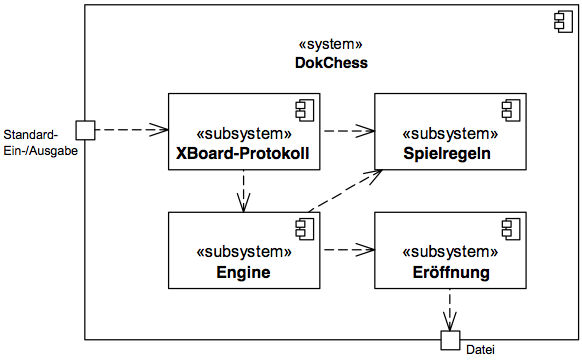

title=5. Bausteinsicht
type=page
status=published
~~~~~~

Dieser Abschnitt beschreibt die Zerlegung von DokChess in Module, wie sie sich auch in der Paketstruktur des Java-Quelltextes widerspiegelt. Module der ersten Zerlegungsebene bezeichnen wir in DokChess als Subsysteme. Die Bausteinsicht Ebene 1 stellt sie inklusive ihrer Schnittstellen dar. Für das Subsystem Engine enthält dieser Überblick auch eine detailliertere Zerlegung in Ebene 2 (→ 5.6). Abschnitt 6.1 („Zugermittlung Walkthrough“) erklärt exemplarisch das Zusammenspiel der Subsysteme zur Laufzeit.

## 5.1	Ebene 1

DokChess zerfällt wie in Bild unten dargestellt in vier Subsysteme. Die gestrichelten Pfeile stellen fachliche Abhängigkeiten der Subsysteme untereinander dar ("x -> y" für "x ist abhängig von y"). Die Kästchen auf der Membran des Systems sind Interaktionspunkte mit Außenstehenden (→ Kontextabgrenzung 3.2).

##### Bild: DokChess, Bausteinsicht, Ebene 1

##### Tabelle: Überblick über Subsysteme von DokChess

| Subsystem | Kurzbeschreibung |
|-----------|------------------|
| XBoard-Protokoll | Realisiert die Kommunikation mit einem Client mit Hilfe des XBoard-Protokolls. |
| Spielregeln | Beinhaltet die Schachregeln und kann z.B. zu einer Stellung alle gültigen Züge ermitteln. |
| Engine | Beinhaltet die Ermittlung eines nächsten Zuges ausgehend von einer Spielsituation. |
| Eröffnung | Stellt Züge aus der Eröffnungsliteratur zu einer Spielsituation bereit.|

## 5.2 XBoard-Protokoll (Blackbox)

### Zweck/Verantwortlichkeit

Dieses Subsystem realisiert die Kommunikation mit einem Client (z.B. einer grafischen Oberfläche) mit Hilfe des textbasierten XBoard-Protokolls (→ Entscheidung 9.1). Das Subsystem liest Befehle über die Standardeingabe ein, prüft sie gegen die Spielregeln und setzt sie für die Engine um. Antworten der Engine (insbesondere ihre Züge) werden vom Subsystem als Ereignisse entgegengenommen, gemäß Protokoll formatiert und über die Standardausgabe zurückgesendet. Das Subsystem treibt somit das ganze Spielgeschehen. Es enthält auch die main-Methode.

### Schnittstellen

Das Subsystem stellt seine Funktionalität über die Java-Klassen _de.dokchess.xboard.XBoard_ und _de.dokchess.xboard.Main_ bereit:

##### Bild: Klassen XBoard und Main

