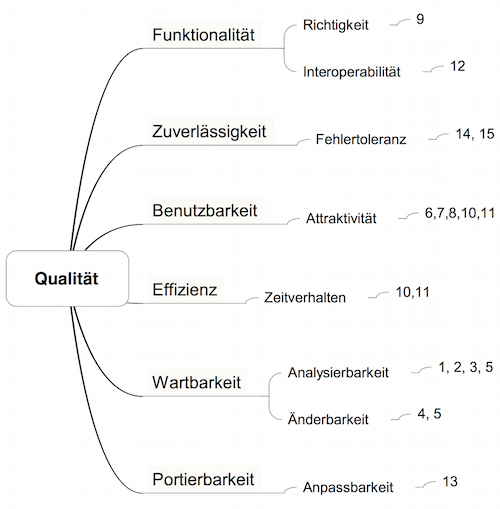

title=10. Qualitätsszenarien
type=page
status=published
~~~~~~

Dieser Abschnitt beinhaltet konkrete Qualitätsszenarien, welche die zentralen Qualitäts- ziele (→ 1.2), aber auch andere geforderte Qualitätseigenschaften besser fassen. Sie ermöglichen es, Entscheidungsoptionen zu bewerten.

## Qualitätsbaum

Das folgende Bild gibt einen Überblick über die relevanten Qualitätsmerkmale und den ihnen jeweils zugeordneten Szenarien.

## Bewertungsszenarien

| Nr. | Szenario           |
|-----|--------------------|
|  1  | Ein Interessierter mit Grundkenntnissen in UML und Schach möchte einen Einstieg in die Architektur von DokChess finden. Lösungsstrategie und Entwurf erschließen sich ihm innerhalb von 15 Minuten.|
|  2  | Ein Architekt, der arc42 anwenden möchte, sucht zu einem beliebigen Kapitel des Templates einen konkreten Beispielinhalt und findet ihn unverzüglich in der Dokumentation.|
|  3  | Ein erfahrener Java-Entwickler sucht die Implementierung eines im Entwurf beschriebenen Moduls. Er findet sie ohne Umwege oder fremde Hilfe im Quelltext.|
|  4  |Ein Entwickler implementiert eine neue Stellungsbewertung. Er kann sie ohne Änderung und ohne Übersetzung vorhandenen Codes in bestehende Strategien integrieren.|
|  5  |Ein Entwickler implementiert eine figurenzentrierte Bitboard-Repräsentation der Spielsituation. Der Aufwand dazu beträgt inklusive des Austauschs der bestehenden, feldzentrierten Darstellung durch die neue maximal eine Woche.|
|  6  | Ein schwacher Spieler zieht in einer Partie gegen die Engine eine Figur ungedeckt und frei von Sinn auf ein von der Engine angegriffenes Feld. Die Engine im Anschluss am Zug nimmt die "eingestellte" Figur.|
|  7	  | In einer Partie ergibt sich für die Engine ein Matt in 2 Zügen. Die Engine zieht sicher zum Sieg.|
|  8	  | Der Engine eröffnet sich eine Springergabel, um Dame oder Turm zu gewinnen. Die Engine gewinnt Dame (bzw. Turm) gegen Springer.|
|  9  | In einer Spielsituation hat die Engine einen oder mehrere regelkonforme Züge zur Auswahl. Sie antwortet mit einem dieser Züge.|
|  10 | Während einer Partie antwortet die Engine auf gegnerische Züge innerhalb von 5 Sekunden mit einem Zug.|
|  11 | Eine in ein grafisches Frontend integrierte Engine spielt schwarz, der menschliche Spieler zieht an. Die Engine antwortet innerhalb von maximal 10 Sekunden mit ihrem ersten Zug, der Benutzer erhält spätestens nach 5 Sekunden eine Rückmeldung, dass die Engine "denkt".|
|  12 | Ein Benutzer will DokChess mit einem Schachfrontend verwenden, das ein von der Lösung implementiertes Kommunikationsprotokoll unterstützt. Das Einbinden erfordert keinerlei Programmieraufwand, die Konfiguration innerhalb des Frontends ist innerhalb von 10 Minuten durchgeführt und getestet. |
|  13 | Ein Java-Programmierer will DokChess mit einem Schachfrontend verwenden, das das Einbinden von Engines erlaubt, aber keines der implementierten Protokolle unterstützt. Das neue Protokoll kann ohne Änderung am bestehenden Code implementiert und die Engine anschließend wie gewohnt eingebunden werden. |
|  14 | Der Engine wird im Spielverlauf ein unzulässiger Gegenzug präsentiert. Die Engine lehnt den Zug ab, erlaubt im Anschluss die Eingabe eines anderen Zuges und spielt fehlerfrei weiter. |
|  15 | Der Engine wird zum Spielbeginn eine unzulässige Stellung präsentiert. Das Verhalten der Engine ist beliebig, ein Abbruch zulässig, unzulässige Züge auch.|
